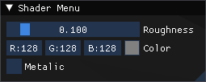

# COMP3015: Developer Tool

This is a brief write up about my CW2 project submission for COMP3015...
In this write up you will find:
A link to the video walkthrough; A link to the git repo; Information about the project and code.

If the images within this ReadMe file do not display, they can all be found in the "ReportMedia" folder of this repository
## About this project
This project is a developer tool to enable a 3D artist to quickly visualise their model in a basic scene with a Physically Based Reflection Shader (PBR) applied to it. In addition to this the project contains vertex animation. This could help a developer to preview how a model might look and behave after it has been rigged for animation while still working on the model.

## Installation/Setup

There is no installation required for the executable, however if you wish to open and run the project in Visual Studio there are some steps you must follow.

### Executable
Inside the **Project.zip** there is a folder called **BUILD** It contains the executable **Project_Template.exe**.
### Project
#### Step One: Opening The Dependencies Window
As mentioned above, running the project through Visual Studio will require some basic setup.
First: Open the **Project** Folder. Inside there is a Visual Studio Solution file: **Project_Template.sln** open it.
Next: In the solution explorer right click **Project_Template** and open **Properties**. This will open the properties window.
Then: Open **VC++ Directories** in the **General** drop down there will be **Include Directories** and **Library Directories**. Follow these next steps for both.
Click on the file path and then on the drop down arrow that will appear. Then click **<Edit...>**
This will open a new window with two file paths, You need to change this file path to fit your machine.
#### Step Two: Setting Dependencies
Inside the **Project** folder there is a folder called **Dependencies** this folder contains 2 folders (**Include** and **lib**). You must add both of these directories to both the **Include Directories** and **Library Directories**.

Then Click **Apply**. You can now close this window.

#### Step Three: Build and Run
The project should now build and run. If there are build errors open the project properties as before and ensure that the project has **glfw3.lib** and **opengl32.lib** under: **Linker**-> **Input**->**Additional Dependencies**

## Program Operation
### Project
To run the project through visual studio ensure you have completed the "Installation/Setup" Portion of this document.
You can then click **Local Windows Debugger** which will run the program.
### Executable
To run the project open/run the **Project_Template.exe** inside the **BUILD** folder.
The program will run and open the display window.
### During Runtime
Program operation is the same during runtime whether you run the executable or visual studio project. 
When you first open the project it is likely that the User interface will look something like this; bunched up in the corner.

To rectify this simply click and drag each window until it is in a position that suits you. Below is the layout that I use

#### Scene layout
The scene should look like the image above: A rippling plane undergoing vertex animation; 9 iterations of the "Spot" model with stepped increases in roughness. In front of that, 5 "Spot" models demonstrating metallic properties. Finally a "Spot" model facing the opposite way. This "Spot" is the placeholder for the custom models. It can be interacted with menus detailed below. The scene has 3 lights. Two of these lights are fixed and one orbits the scene. This light can also be manipulated with the user interface.

#### Shader Menu

The shader menu changes the properties of the shader attached to the object in the middle of the scene. The controls update the shader uniforms which will update the material properties of the object.
#### Animation Menu

The animation menu changes the properties of the vertex animation within the shader. The **Velocity** slider changes the speed of the Sine wave, **Amplitude** changes the height of the Sine wave, **Frequency** changes the frequency of the wave and the **Animate** checkbox toggles the middle scene object between animating and not animating.
#### Lights Menu

The lights menu controls the primary light in the scene. The other two lights are permanent within the scene and cannot be controlled. **Rotation Speed** Changes how fast the light orbits the scene. **Intensity** Controls the RGB colour and strength of the light.
#### Object Menu

The object menu houses a lot of controls, however most of the controls are relatively intuitive.  To break it down each of the following paragraphs will cover each block of controls.
##### File loading
To load a custom model into the scene, simply type the name of the file into the **Your filename** box, then click **Get File**. Be sure to use the exact file name and that it is of the ".obj" filetype. (Note: Including ".obj" in the filename box is not necessary but can be done) If you do not wish to load a custom file you can chose from multiple objects with the **Object Loaded** drop down.

##### Object Position
The first block of sliders control where in the scene the object appears. Changing the sliders will change the X, Y and Z coordinates of the object. The **Reset Pos** button will reset all of the sliders to 0, replacing the object in the centre of the scene.

##### Object Scale
The second set of sliders control the scale of the object. The X, Y and Z sliders will change the scale of the object along its relative axes. the W slider will change the scale of the whole object uniformly independently of the other scale sliders. The **Reset Scale** button will reset all of the scale sliders to 1, restoring the original proportions of the object,

##### Object Rotation
The final set of sliders control the rotation of the object in the X, Y and Z axes. The **Reset Rot** button will reset all of the sliders to 0. Reverting each axis to its original state.
### Known Issues
Enabling both the Metallic and Animated uniforms can cause some quirks with the way that the PBR reflections are calculated.

## Links
### YouTube Video
[YouTube Link]
### Git Repo
https://github.com/MattHough1999/COMP3015-summer-referral/
